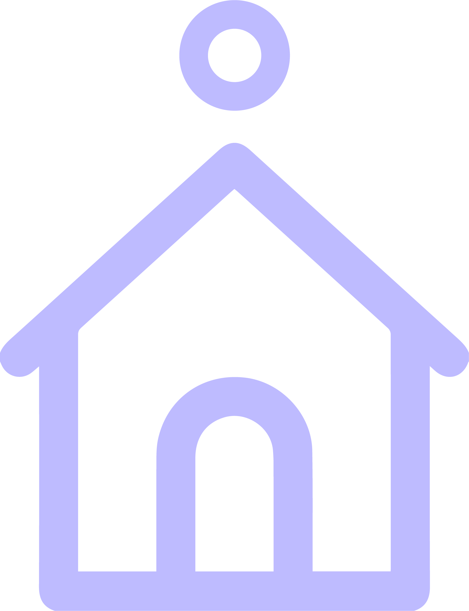
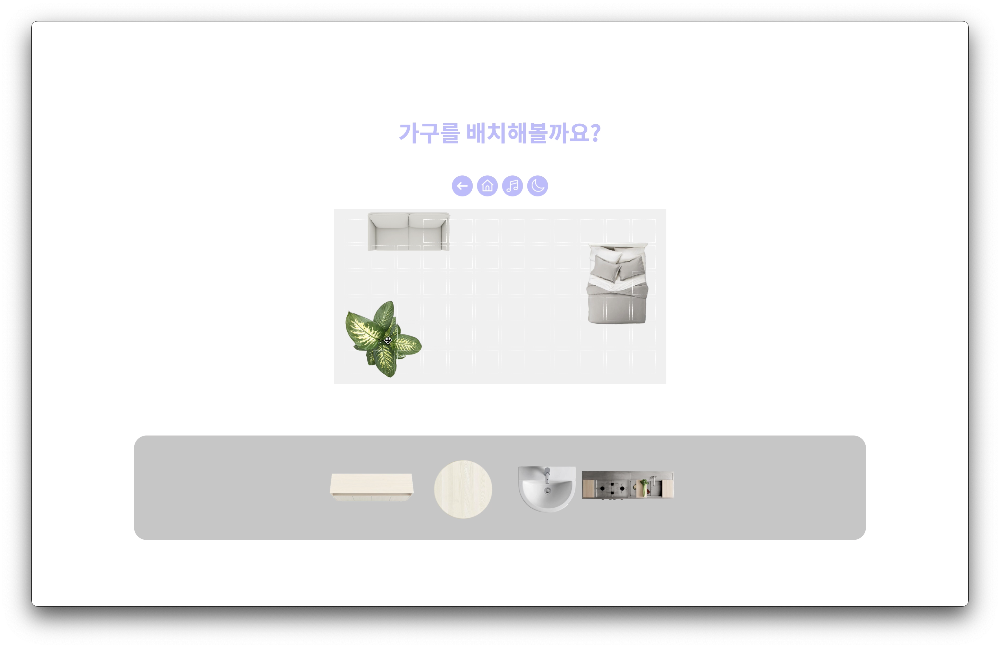
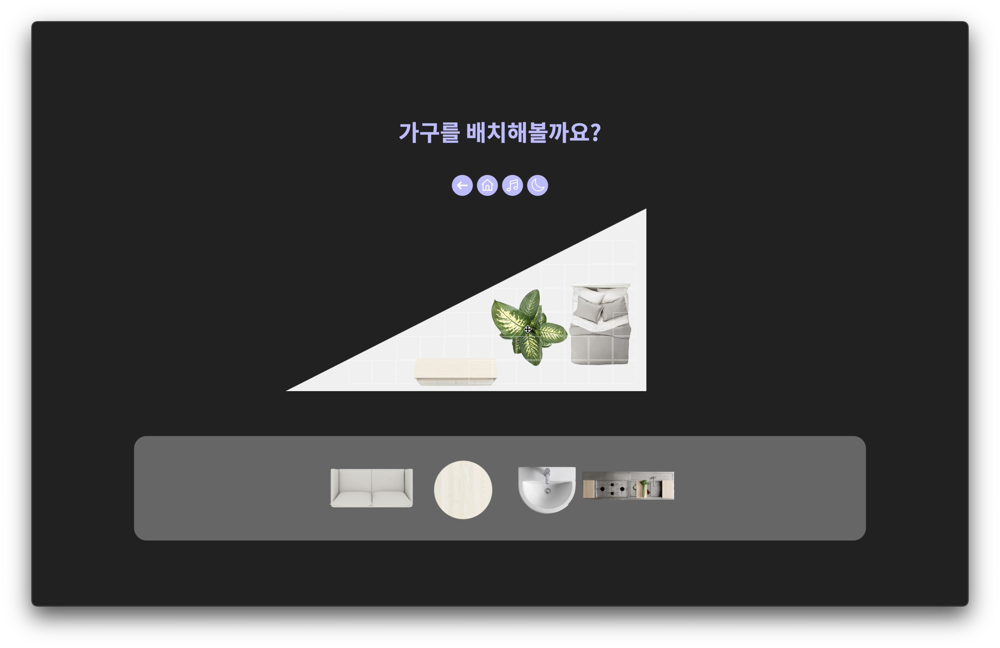

<h1>
  
  RoomSketch (2021)
</h1>

**A web-based interior design tool created as a term project for a Web Contents Development course.**  
*The logo represents a house with a dot on the roof, symbolizing a pencil—reflecting the idea of "sketching" room designs.*

## 📌 Overview  
### **🔹 Addressing a Common Problem**
Many people struggle with interior design decisions, yet **most planning tools are designed for professionals**.  
As a result, users often rely on **watching videos or making rough sketches**, which **lack interactivity and control**.  

### **🔹 RoomSketch: A More Intuitive Solution**
RoomSketch provides a **freeform, highly interactive environment** where users can:  
✔ **Design custom room layouts**  
✔ **Drag & drop furniture seamlessly**  
✔ **Easily switch between light & dark modes** for better usability  

## 🎥 Demo Video  
[▶ Watch the Demo on YouTube](https://youtu.be/Ba1gTAKq3Fg)  

## 🎨 User Interface & Features  

  
  

### **🌟 Key Features**
- **Simple & Engaging UI:** Large, rounded buttons with a soft lavender theme for a **modern, youthful look**  
- **Drag & Drop Furniture Placement:** Snapping mechanism ensures smooth and precise placement  
- **Light & Dark Mode Support:** Reduces eye strain and provides a customizable experience  
- **Interactive Room Selection:** Users can choose from different room layouts before designing  
- **Rotation & Realignment:** Clicking on furniture rotates it 90° to allow for versatile placement  
- **Background Music for Immersion:** Love House BGM plays in the background for a fun experience  

## 🚀 How It Works
1️⃣ **Start Screen:**  
- Features a **bold, game-like start button** for immersion  
- Hover effects provide smooth color transitions  

2️⃣ **Room Selection:**  
- Users can **select a room layout** based on their real space  
- The design maintains consistency with the start screen for a **cohesive experience**  

3️⃣ **Design Mode (Main Interface):**  
- **Centralized layout** with a clear title and functional buttons (Back, Home, Music, Dark Mode)  
- **Snapping grid lines** help users align furniture more accurately  
- **Return-to-Inventory Feature:** Users can remove furniture by placing it back in the inventory  

4️⃣ **Furniture Rotation & Cursor Feedback:**  
- Clicking on furniture rotates it **90° per click**  
- Cursor changes when hovering over objects to indicate **draggable elements**  

---

## 📂 Project Files
- `code/` → Contains **HTML, CSS, JavaScript** files and png files
- `img/` → UI images for readme 
